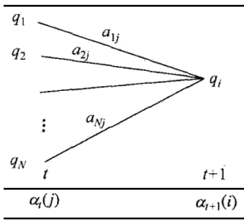
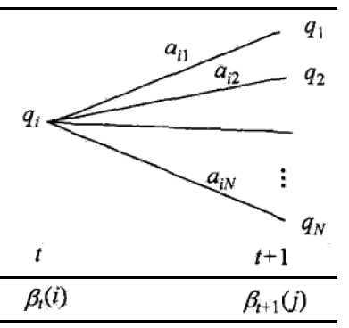

<a class="toc" id="table-of-contents"></a>
# Table of Contents
+ [Hidden Markov Model (隐马尔科夫模型)](#0)
+ [定义](#1)
+ [基本问题](#2)
+ [前向算法](#3)
	+ [算法流程](#3-1)
	+ [实现代码](#3-2)
+ [后向算法](#4)
	+ [算法流程](#4-1)
	+ [实现代码](#4-2)
+ [Viterbi算法](#5)
	+ [算法流程](#5-1)
	+ [实现代码](#5-2)
+ [Baum-Welch 算法](#6)
	+ [单观测序列](#6-1)
	+ [多观测序列](#6-2)
	+ [实现代码（单观测序列）](#6-3)
+ [符号总结](#7)
+ [hmmlearn](#8)
	+ [安装](#8-1)
	+ [使用 ](#8-2)
	+ [常见错误](#8-3)
+ [GitHub](#9)
+ [参考资料](#10)


<a class="toc" id ="0"></a>
# Hidden Markov Model (隐马尔科夫模型)
[Back to TOC](#table-of-contents)

两种问题特征：
+ 基于序列的，比如时间序列，或者状态序列
+ 两类数据，一类序列数据是可以观测到的，即观测序列；而另一类数据是不能观察到的，即隐藏状态序列，简称状态序列

<a class="toc" id ="1"></a>
# 定义
[Back to TOC](#table-of-contents)

假设$N$是可能的隐藏状态数，$M$是可能的观测状态数，定义
$$
\mathcal{Q}=\{q_1,q_2,\dots,q_N\},\mathcal{V}=\{v_1,v_2,\dots,v_M\}
$$
分别为所有可能的隐藏状态和所有可能的观测状态的集合
同时，对于一个长度为$T$的序列$I$，和对应的观测序列$O$
$$
\mathcal{I}=\{s_1,s_2,\dots,s_T\},\mathcal{O}=\{o_1,o_2,\dots,o_T\}
$$
HMM做了两个很重要的假设：
+ 齐次马尔科夫链假设。任意时刻隐藏状态只依赖于它前一个隐藏状态
定义状态转移概率$A_{ij}$为**从当前时刻$t$的状态$s_i$转移到下一时刻$t+1$的状态$s_j$的概率**，即
$$
A_{ij}=P(s_{t+1}=q_j|s_t=q_i)
$$
从而定义状态转移矩阵$A\in \mathbb{R}^{N\times N}$
+ 观测独立性假设即任意时刻的观测状态只仅仅依赖于当前时刻的隐藏状态。定义生成概率$B_{ij}$为**由隐藏状态$s_i$生成观测状态$q_j$的概率**，即
$$
B_{ij}=P(o_t=v_i|s_t=q_j)
$$
从而定义生成概率矩阵(发射矩阵)$B\in \mathbb{R}^{N\times M}$
最后，定义在$t$时刻的隐藏状态分布$\Pi_t=[\pi_t (k)]$，其中$\pi_t (k)=P(s_t=q_k)$
因此一个HMM模型主要由三个参数表示：
$$
\lambda=(A,B,\Pi)
$$
<a class="toc" id ="2"></a>
# 基本问题
[Back to TOC](#table-of-contents)

+ 1. 评估观察序列概率。给定模型$\lambda$和观测序列$\mathcal{O}$，计算在模型$\lambda$下该观测序列$\mathcal{O}$出现的概率$P(\mathcal{O}|\lambda)$。求解方法：前向后向算法
+ 2. 预测问题。给定观测序列$\mathcal{O}=\{o_1,o_2,\dots,o_T\}$和模型参数$\lambda=（A,B,\Pi)$，求解最有可能出现的**隐藏状态序列**。求解方法：Viterbi算法
+ 3. 模型参数学习问题。给定观测序列$\mathcal{O}=\{o_1,o_2,\dots,o_T\}$，求解模型参数$\lambda=（A,B,\Pi)$使得$P(\mathcal{O}|\lambda)$最大。求解方法：Baum-Welch算法(EM算法)
<a class="toc" id ="3"></a>
# 前向算法
[Back to TOC](#table-of-contents)



<a class="toc" id ="3-1"></a>
## 算法流程
输入：观测序列$\mathcal{O}=\{o_1,o_2,\dots,o_T\}$，模型参数$\lambda=（A,B,\Pi)$
输出：观测序列$P(O|\lambda)$
步骤：
+ 计算时刻1各个隐藏状态$s_i$的前向概率
$$
\alpha_1(i)=\pi(i)B_{i,o_1},i=1,2,\dots,N
$$
+ 递推$2,3,\dots,T$时刻的前向概率
$$
\alpha_{t+1}(i)=[\sum_{j=1}^{N}\alpha_{t}(j)A_{ji}]B_{i,o_{t+1}},i=1,2,\dots,N
$$
+ 最终结果
$$
P(\mathcal{O}|\lambda)=\sum_i^N\alpha_T(i)
$$
<a class="toc" id ="3-2"></a>
## 实现代码
```python
def HMMfwd(pi, a, b, obs):
    '''
    pi:初始概率分布
    a:状态转移矩阵
    b:发射矩阵
    obs:观测序列
    '''

    nStates = np.shape(b)[0]
    T = np.shape(obs)[0]

    alpha = np.zeros((nStates,T))
    '''alpha[i,t]表示上述公式的 alpha_t(i)'''
    alpha[:,0] = pi*b[:,obs[0]]

    for t in range(1,T):
        for s in range(nStates):
            alpha[s,t] = b[s,obs[t]] * np.sum(alpha[:,t-1] * a[:,s])

    return alpha
```
最后计算$P(\mathcal{O}|\lambda)$
```python
np.sum(alpha[:,-1])
```
<a class="toc" id ="4"></a>
# 后向算法
[Back to TOC](#table-of-contents)


<a class="toc" id ="4-1"></a>
## 算法流程
输入：观测序列$\mathcal{O}=\{o_1,o_2,\dots,o_T\}$，模型参数$\lambda=（A,B,\Pi)$
输出：观测序列$P(O|\lambda)$
步骤：
+ 初始化时刻$T$各个隐藏状态$s_i$的前向概率
$$
\beta_T(i)=1, i=1,2,\dots,N
$$
+ 递推$T-1,T-2,\dots,1$时刻的后向概率
$$
\beta_{t}(i)=\sum_{i=1}^{N}A_{ij}B_{j,o_{t+1}}\beta_{t+1}(j),i=1,2,\dots,N
$$
+ 最终结果
$$
P(\mathcal{O}|\lambda)=\sum_i^N\pi_iB_{i,o_1}\beta_1(i)
$$
<a class="toc" id ="4-2"></a>
## 实现代码
```python
def HMMbwd(a, b, obs):
    '''
    a:状态转移矩阵
    b:发射矩阵
    obs:观测序列
    '''

    nStates = np.shape(b)[0]
    T = np.shape(obs)[0]
    '''beta[i,t]表示上述公式的 beta_t(i)'''
    beta = np.zeros((nStates,T))

    beta[:,-1] = 1.0 

    for t in range(T-2,-1,-1):
        for s in range(nStates):
            beta[s,t] = np.sum(a[s,:] * b[:,obs[t+1]] * beta[:,t+1] )

    return beta
```
最后计算$P(\mathcal{O}|\lambda)$
```python
np.sum(pi*b[:,obs[0]]*beta[:,0])
```


<a class="toc" id ="5"></a>
# Viterbi算法
[Back to TOC](#table-of-contents)

<a class="toc" id ="5-1"></a>
## 算法流程
输入：观测序列$\mathcal{O}=\{o_1,o_2,\dots,o_T\}$，模型参数$\lambda=（A,B,\Pi)$
输出：最有可能的有隐状态序列 $\mathcal{I}^*=\{i^{*}_1,i^{*}_2,\dots,i^{*}_T\}$
步骤：
+ 初始化局部状态
$$
\delta_1(i)=\pi_iB_{i,o_1},\quad \Phi_1(i)=0,\quad i=1,2,\dots,N
$$
+ 进行动态规划递推时刻$t=2,3,\dots,T$的局部状态
$$
\begin{array}{c}
{\delta_t(i)=\max_{1\leq j\leq N}[\delta_{t-1}(j)A_{j,i}]B_{i,o_t},\quad i=1,2,\dots,N}
\\
\\
{\Phi_t(i)=\arg \max_{1\leq j\leq N}[\delta_{t-1}(j)A_{j,i}],\quad i=1,2,\dots,N}
\end{array}
$$
+ 计算时刻$T$最大的$\delta_T(i)$即为最可能隐藏状态序列出现的概率，计算时刻$T$最大的$\Phi_T(i)$，即为最可能的隐藏状态
$$
i^*_T=\arg \max_{1\leq j\leq N}\delta_{T}(i)
$$
+ 利用局部状态$\Phi(i)$开始回溯，对于时刻$t=T-1,T-2,\dots,1$：
$$
i^*_t=\Phi_{t+1}(i^*_{t+1})
$$
+ 最终得到最有可能的隐藏状态序列$\mathcal{I}^*=\{i^{*}_1,i^{*}_2,\dots,i^{*}_T\}$
<a class="toc" id ="5-2"></a>
## 实现代码
```python
def Viterbi(pi, a, b, obs):
    '''
    pi:初始概率分布
    a:状态转移矩阵
    b:发射矩阵
    obs:观测序列
    '''

     nStates = np.shape(b)[0]
    T = np.shape(obs)[0]

    path = np.zeros(T, dtype=np.int32)
    delta = np.zeros((nStates,T))
    phi = np.zeros((nStates,T))

    delta[:,0] = pi * b[:,obs[0]]
    phi[:,0] = 0

    for t in range(1,T):
        for s in range(nStates):
            delta[s,t] = np.max(delta[:,t-1]*a[:,s])*b[s,obs[t]]
            phi[s,t] = np.argmax(delta[:,t-1]*a[:,s])

    path[-1] = np.argmax(delta[:,-1])
    for t in range(T-2,-1,-1):
        path[t] = phi[path[t+1],t+1]

    return path
```
最后解码得到的序列即为`path`

<a class="toc" id ="6"></a>
# Baum-Welch 算法
[Back to TOC](#table-of-contents)

<a class="toc" id ="6-1"></a>
## 单观测序列
输入：$1$个观测序列样本$\mathcal{O}=\{o_1,o_2,\dots,o_T\}$
输出：模型参数$\lambda=（A,B,\Pi)$
步骤：
+ 随机初始化或手动初始化$A,B,\Pi$
+ E 步，求解两个中间变量$\gamma_{t}(i), \xi_{t}(i, j)$，两者含义如下
    + $\gamma_{t}(i)$：给定模型$\lambda$和观测序列$\mathcal{O}$，在时刻$t$的隐含状态为$q_i$的概率，即$\gamma_{t}(i)=P(s_{t}=q_{i} | O, \lambda)$
    + $\xi_{t}(i, j)$：给定模型$\lambda$和观测序列$\mathcal{O}$，在时刻$t$的隐含状态为$q_i$，时刻$t+1$的隐含状态为$q_j$的概率，即$\xi_{t}(i, j)=P(s_{t}=q_{i}, s_{t+1}=q_{j} | O, \lambda)$
    结合前面的前向概率和后向概率的定义，计算这两个中间变量的公式如下：
    $$
    \begin{array}{c}{\gamma_{t}(i)=\frac{\alpha_{t}(i) \beta_{t}(i)}{\sum_{j=1}^{N} \alpha_{t}(j) \beta_{t}(j)}} 
    \\ 
    \\
    {\xi_{t}(i, j)=\frac{\alpha_{t}(i) A_{i j} B_{j,o_{t+1}} \beta_{t+1}(j)}{\sum_{p=1}^{N} \sum_{q=1}^{N} \alpha_{t}(p) A_{pq} B_{q,o_{t+1}} \beta_{t+1}(q)}}\end{array}
    $$
+ M 步，通过 E 步求解出的两个中间变量来求解模型参数，求解公式如下：
$$
\begin{array}{c}
{A_{i j}=\frac{\sum_{t=1}^{T-1} \xi_{t}(i, j)}{\sum_{t=1}^{T-1} \gamma_{t}(i)}} 
\\ 
\\
{B_{ij}=\frac{\sum_{t=1}^{T} \gamma_{t}(i) I\left(o_{t}=v_{j}\right)}{\sum_{t=1}^{T} \gamma_{t}(i)}} 
\\ 
\\
{\pi_{i}=\gamma_{1}(i)}
\end{array}
$$
上式中的$I(o_{t}=v_{j})$表示当时刻$t$观测状态为 $v_k$ 时，$I(o_{t}=v_{j})=1$，否则$I(o_{t} = v_{j})=0$
<a class="toc" id ="6-2"></a>
## 多观测序列
输入：$D$个观测序列样本$\{\mathcal{O}_1,\mathcal{O}_2,\dots,\mathcal{O}_D\}$，其中$\mathcal{O}_d=\{o_1,o_2,\dots,o_T\},d=1,2,\dots,D$
输出：模型参数$\lambda =（A,B,\Pi)$
步骤：
+ 随机初始化或手动初始化$A,B,\Pi$
+ E 步，为每个序列求解两个中间变量$\gamma^{(d)}_{t}(i), \xi^{(d)}_{t}(i, j)$
    类似单观测序列，只不过每个序列各自用前向后向算法求出各自的$\alpha^{(d)}$和$\beta^{(d)}$，求解公式如下：
    $$
    \begin{array}{c}{\gamma^{(d)}_{t}(i)=\frac{\alpha^{(d)}_{t}(i) \beta^{(d)}_{t}(i)}{\sum_{j=1}^{N} \alpha^{(d)}_{t}(j) \beta^{(d)}_{t}(j)}} 
    \\ 
    \\
    {\xi^{(d)}_{t}(i, j)=\frac{\alpha^{(d)}_{t}(i) A_{i j} B_{j,o_{t+1}} \beta^{(d)}_{t+1}(j)}{\sum_{p=1}^{N} \sum_{q=1}^{N} \alpha^{(d)}_{t}(p) A_{pq} B_{q,o_{t+1}} \beta^{(d)}_{t+1}(q)}}\end{array}
    $$
+ M 步，通过 E 步求解出的两个中间变量来求解模型参数，同样类似单观测序列，只不过更新参数时需要考虑所有序列（即外层加上一个求和复方蒿），求解公式如下：
$$
\begin{array}{c}
{A_{i j}=\frac{\sum_{d=1}^D \sum_{t=1}^{T-1} \xi^{(d)}_{t}(i, j)}{\sum_{d=1}^D \sum_{t=1}^{T-1} \gamma^{(d)}_{t}(i)}} 
\\ 
\\
{B_{ij}=\frac{\sum_{d=1}^D \sum_{t=1}^{T} \gamma^{(d)}_{t}(i) I\left(o_{t}=v_{j}\right)}{\sum_{d=1}^D \sum_{t=1}^{T} \gamma^{(d)}_{t}(i)}} 
\\ 
\\
{\pi_{i}=\frac{\sum_{d=1}^D \gamma^{(d)}_{1}(i)}{D}}
\end{array}
$$
同样的，上式中的$I(o_{t}=v_{j})$表示当时刻$t$观测状态为 $v_k$ 时，$I(o_{t}=v_{j})=1$，否则$I(o_{t} = v_{j})=0$
<a class="toc" id ="6-3"></a>
## 实现代码（单观测序列）
```python
def BaumWelch(obs, n_states, n_obs, pi=None, a=None, b=None, tol=1e-2, n_iter=10):
    T = np.shape(obs)[0]
    # initialize
    if not pi:
        pi = np.ones((n_states))/n_states
    if not a:
        a = np.random.rand(n_states, n_states)
    if not b:
        b = np.random.rand(n_states, n_obs)
    xi = np.zeros((n_states, n_states, T))
    
    nits = 0
    while True:
        nits += 1
        old_a = a.copy()
        old_b = b.copy()
        alpha = HMMfwd(pi, a, b, obs)
        beta = HMMbwd(a, b, obs)
        gamma = alpha*beta
        gamma /= gamma.sum(0)
        
        # E-step
        for t in range(T-1):
            for i in range(n_states):
                for j in range(n_states):
                    xi[i, j, t] = alpha[i,t]*beta[j,t+1]*a[i,j]*b[j,obs[t+1]]
            xi[:,:,t] /= xi[:,:,t].sum()
            
        # The last step has no b, beta in
        for i in range(n_states):
            for j in range(n_states):
                xi[i,j,-1] = alpha[i,-1]*a[i,j]
        xi[:,:,-1] /= xi[:,:,-1].sum()
        
        # M-step
        for i in range(n_states):
            for j in range(n_states):
                a[i,j] = xi[i,j,:-1].sum()/gamma[i,:-1].sum()
                
        a /= a.sum(1, keepdims=True)
        
        for i in range(n_states):
            for j in range(n_obs):
                found = (obs==j).nonzero()[0]
                b[i,j] = gamma[i,found].sum()/gamma[i].sum()
                
        b /= b.sum(1, keepdims=True)
        
        pi = gamma[:, 0]

        if np.linalg.norm(a - old_a) < tol and np.linalg.norm(b - old_b)< tol or nits > n_iter:
            break
            
    return pi, a, b
```

<a class="toc" id ="7"></a>
# 符号总结
[Back to TOC](#table-of-contents)

|符号|解释|符号|解释|
|:-:|:-:|:-:|:-:|
|$N$|可能的隐藏状态数|$M$|可能的观测状态数|
|$\mathcal{Q}=\{q_1,q_2,\dots,q_N\}$|所有可能的隐藏状态集合|$\mathcal{V}=\{v_1,v_2,\dots,v_M\}$|所有可能的观测状态的集合|
|$\mathcal{I}=\{s_1,s_2,\dots,s_T\}$|真实隐藏状态|$\mathcal{O}=\{o_1,o_2,\dots,o_T\}$|真实观测序列|
|$A_{ij}$|从当前时刻$t$的状态$s_i$转移到下一时刻$t+1$的状态$s_j$的概率|$B_{ij}$|由隐藏状态$s_i$生成观测状态$q_j$的概率|
|$\Pi_t=[\pi_t (k)]$|$\pi_t (k)=P(s_t=q_k)$代表$t$时刻的隐藏状态为$q_k$的概率，一般忽略时刻$t$简写为$\pi_k$|$\lambda$|$\lambda=(A,B,\Pi)$为模型参数|
|$\delta_t(i)$|表示$t$时刻隐状态的取值$s_t=q_i$,观测状态为$o_t$的最大概率|$\Phi_t(i)$|表示$t$时刻隐藏状态为$q_i$，观测状态为$o_t$的最大概率，是由上一时刻哪一个隐藏状态转移而来的
|$\alpha_t(i)$|$t$时刻隐藏状态为$q_i$且$1$时刻到$t$时刻的观测序列为$o_{1},o_{2},\dots,o_{t}$的前向概率|$\beta_t(i)$|$t$时刻隐藏状态为$q_i$且$t+1$时刻到$T$时刻的观测序列为$o_{t+1},o_{t+2},\dots,o_{T}$的后向概率|
|$\gamma_{t}(i)$|给定模型$\lambda$和观测序列$\mathcal{O}$，在时刻$t$的隐含状态为$q_i$的概率，即$\gamma_{t}(i)=P(s_{t}=q_{i} \| O, \lambda)$| $\xi_{t}(i, j)$|给定模型$\lambda$和观测序列$\mathcal{O}$，在时刻$t$的隐含状态为$q_i$，时刻$t+1$的隐含状态为$q_j$的概率，即$\xi_{t}(i, j)=P(s_{t}=q_{i}, s_{t+1}=q_{j} \| O, \lambda)$|
|$I(o_{t}=v_{j})$|当时刻$t$观测状态为 $v_k$ 时，$I(o_{t}=v_{j})=1$，否则$I(o_{t} = v_{j})=0$|


<a class="toc" id ="8"></a>
# hmmlearn
[Back to TOC](#table-of-contents)

hmmlearn 是一个用于隐马尔可夫模型无监督学习和推理的算法库，其提供了易于使用的类似于sklearn的API。

<a class="toc" id ="8-1"></a>
## 安装
```bash
pip install hmmlearn
```
注意：前提是要有gcc编译器，因为部分源代码由C编译而成。
当前版本：V 0.2.2
<a class="toc" id ="8-2"></a>
## 使用 
这里只介绍通用的离散HMM模型的使用（序列是离散的）
+ 建立一个HMM模型
```python
from  hmmlearn import hmm

model = hmm.MultinomialHMM(n_components=n_states, tol=1e-2, n_iter=10, init_params='')
model.startprob_ = init_pi
model.transmat_ = init_T
model.emissionprob_ = init_E
```
如果是自己初始化的话，`init_params=''`，否则模型随机初始化（默认）`init_params='ste'`代表初始化三个参数，并且需要手动设定`model.n_features = n_obs`
+ `hmm.MultinomialHMM` 相关参数
    + `n_components` : int
    Number of states. (隐状态数)

    + `startprob_prior` : array, shape (n_components, ), optional
    Parameters of the Dirichlet prior distribution for
    :attr:`startprob_`.

    + `transmat_prior` : array, shape (n_components, n_components), optional
    Parameters of the Dirichlet prior distribution for each row
    of the transition probabilities :attr:`transmat_`.

    + `algorithm` : string, optional
    Decoder algorithm. Must be one of "viterbi" or "map".
    Defaults to "viterbi".

    + `random_state`: RandomState or an int seed, optional
    A random number generator instance.

    + `n_iter` : int, optional
    Maximum number of iterations to perform.

    + `tol` : float, optional
    Convergence threshold. EM will stop if the gain in log-likelihood
    is below this value.

    + `verbose` : bool, optional
    When ``True`` per-iteration convergence reports are printed
    to :data:`sys.stderr`. You can diagnose convergence via the
    :attr:`monitor_` attribute.

    + `params` : string, optional
    Controls which parameters are updated in the training
    process.  Can contain any combination of 's' for startprob,
    't' for transmat, 'e' for emissionprob.
    Defaults to all parameters.

    + `init_params` : string, optional
    Controls which parameters are initialized prior to
    training.  Can contain any combination of 's' for
    startprob, 't' for transmat, 'e' for emissionprob.
    Defaults to all parameters.

+ 计算$P(\mathcal{O}|\lambda)$（问题1）
```python
model.score(obs.T)
```
+ Viterbi 算法解码（问题2）
```python
model.decode(obs.T)
```
+ Baum-Welch 算法训练（问题3）
```python
model.fit(obs.T)
```

<a class="toc" id ="8-3"></a>
## 常见错误
+ **Expected 2D array, got 1D array instead**
输入的`obs`序列需要是一个[n_sample,n_obs]的二维数组，如果只有一个观测序列，需要将其扩展为二维，使用 ``np.atleast_2d(obs)``
+ **Buffer dtype mismatch, expected 'dtype_t' but got 'float'**
由于hmmlearn库在前向传播的时候调用的是C编译的代码，因此如果传入的变量类型不为`float64`则会报如上错误。解决办法：将传入的初始化变量类型改为`np.float64`。
+ **arrays used as indices must be of integer (or boolean) type**
传入的`obs`序列需要为整型
+ **expected a sample from a Multinomial distribution.**
源码的解释是：  ``X`` should be an array of non-negative integers from range ``[min(X), max(X)]``, such that each integer from the range occurs in ``X`` at least once. For example ``[0, 0, 2, 1, 3, 1, 1]`` is a valid sample from a Multinomial distribution, while ``[0, 0, 3, 5, 10]`` is not.
也就是说传入的序列需要每个obs都至少出现一次，但这在大多数情况下不太可能，官方GitHub的解决办法是：
```python
>>> from sklearn.preprocessing import LabelEncoder
>>> LabelEncoder().fit_transform([0, 1, 5, 10])
array([0, 1, 2, 3])
```
但是这样重新编码不就是失去了一些状态？因此我的解决办法是，注释掉`hmm.py`第`407`行左右的`self._check_input_symbols(X)`语句，不让它对输入进行检查，然后对于第`436`行可能出错的代码进行一点小改进
```python
def _compute_log_likelihood(self, X):
        return np.log(self.emissionprob_)[:, np.concatenate(X)].T
```
增加一个微小常数，改为
```python
def _compute_log_likelihood(self, X):
        return np.log(self.emissionprob_ + 1e-10)[:, np.concatenate(X)].T
```
<a class="toc" id ="9"></a>
# GitHub
[Back to TOC](#table-of-contents)

[源代码GitHub传送门](https://github.com/EdisonLeeeee/HMM_Algorithms)
<a class="toc" id ="10"></a>
# 参考资料
[Back to TOC](#table-of-contents)

+ [刘建平：隐马尔科夫模型HMM](https://www.cnblogs.com/pinard/p/6945257.html)
+ [MarslandMLAlgo](https://github.com/alexsosn/MarslandMLAlgo/blob/master/Ch16/HMM.py)
+ [hmmlearn](https://github.com/hmmlearn/hmmlearn)
+ [吴良超：隐马尔可夫模型的三大问题及求解方法 ](http://wulc.me/2017/07/14/%E9%9A%90%E9%A9%AC%E5%B0%94%E5%8F%AF%E5%A4%AB%E6%A8%A1%E5%9E%8B%E7%9A%84%E4%B8%89%E5%A4%A7%E9%97%AE%E9%A2%98%E5%8F%8A%E6%B1%82%E8%A7%A3%E6%96%B9%E6%B3%95/)
+ [Baum-Welch algorithm: Finding parameters for our HMM](https://jyyuan.wordpress.com/2014/01/28/baum-welch-algorithm-finding-parameters-for-our-hmm/)
+ [一站式解决：隐马尔可夫模型（HMM）全过程推导及实现](https://zhuanlan.zhihu.com/p/85454896)


